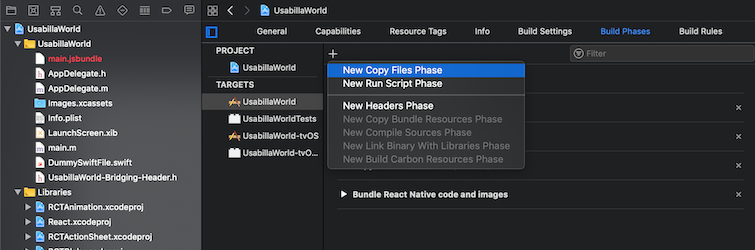

[](https://github.com/usabilla/usabilla-u4a-react-native/blob/develop/LICENSE)


# Usabilla for Apps - React Native

Usabilla for Apps allows you to collect feedback from your users with great ease and flexibility.
This React Native bridge to the Native Usabilla SDK allows you to load passive feedback forms and submit results from a React Native app. This release uses the Usabilla SDK v6.4.4.
This React Native bridge supports React Native app builds with version `0.61.5` that contains Auto-Linking. For React Native versions without Auto-Linking, please follow these steps.

- [Usabilla for Apps - React Native](#usabilla-for-apps---react-native)
  - [Requirements](#requirements)
  - [Installation](#installation)
    - [iOS](#ios)
    - [Android](#android)
  - [Campaigns](#campaigns)
    - [The App Id](#the-app-id)
    - [Events](#events)
    - [Campaign submission callback](#campaign-submission-callback)
    - [Reset Campaign data](#reset-campaign-data)
    - [Managing an existing Campaign](#managing-an-existing-campaign)
    - [Campaign results](#campaign-results)
  - [Feedback Form](#feedback-form)
    - [The Form ID](#the-form-id)
    - [Screenshot](#screenshot)
    - [Submit the results of the form](#submit-the-results-of-the-form)
    - [Feedback submission callback](#feedback-submission-callback)
  - [Custom Variables](#custom-variables)
  - [Installation steps for React Native without Auto-Linking](#installation-steps-for-react-native-without-auto-linking)
    - [Android](#android-1)
    - [iOS](#ios-1)
  - [Support](#support)

## Requirements

This version of the react native bridge works with the latest release of `XCode 11`.
For Xcode versions between `XCode 9.3` to `XCode 10.3` please use the package version `@0.8.2` and lesser till `@0.5.4`.
For Xcode versions lesser than `XCode 9.3` please use the package version `@0.5.3` or less.

## Installation

The installation of this SDK consists out of two parts, one part for your projects a whole and the second part for iOS(#ios) and Android(#android) specifically. To install the Usabilla SDK into your React Native Application:

In a terminal window, navigate to the root directory of your project and run :

```
yarn add usabilla-react-native
```

### iOS

This release uses the Usabilla SDK v6.4.4.

Fetching the latest Usabilla SDK can be done by updating the pod. This can be done with the following command:
`cd ios && pod --repo-update install && cd ..`

The native Usabilla SDK is written in Swift, so make sure that your iOS Project contains a Bridging-Header file or add one.
   The default project created by react-native will not create this. 
   To have XCode create the bridge-header automatically, open the ios-project in XCode:
   - select "New File"
   - select "Swift file"
   - save it with any name, as its not being used
   - choose "Create Bridging Header"
   
   
   
   

You can start using the Usabilla for React Native module in your app by requiring:

`const usabilla = require('usabilla-react-native')`

### Android

1. Make sure that your `MainActivity.java` extends `ReactFragmentActivity`
2. In case of compilation problems in Android Studio, set the `compileSdkVersion` in the app module `build.gradle` to `26`
3. You can start using the Usabilla for React Native module in your app by requiring:

`const usabilla = require('usabilla-react-native')`

## Campaigns

In the Usabilla for Apps Platform, a campaign is defined as a proactive survey targeted to a specific set of users.

Being able to run campaigns in your mobile app is great because it allows you to collect more specific insights from your targeted users. What is even better is that creating new and managing existing campaigns can be done without the need for a new release of your app. Everything can be managed from the Usabilla web interface.

You can run as many campaigns as you like and target them to be triggered when a specific set of targeting options are met.
The configuration of how a campaign is displayed to the user will be familiar to existing Usabilla customers. You can configure it to suit your needs just like you are used to from the Passive feedback forms.

The most important aspect of running a mobile campaign is 'Events'. Events are custom triggers that are configured in the SDK. When a pre-defined event occurs, it will allow you to trigger a campaign. A good example of an event is a successful purchase by a user in your app.

### The App Id

The app Id is an identifier used to associate campaigns to a mobile app.
By loading the SDK with a specific app Id, it will fetch all the campaigns connected to the given app Id.

It is possible to target a campaign to more than one app (e.g. iOS Production App, iOS Beta App) by associating it with multiple App Ids.

To run campaigns in your app, you should first start by initializing the SDK and define the App ID that is generated in [Usabilla](https://app.usabilla.com/member/live/apps/campaigns/add):

`usabilla.initialize("YOUR_APP_ID")`

This call loads and updates all your campaigns locally and you can start targeting them by sending events from your app.

### Events

Campaigns are triggered by events. Events are used to communicate with the SDK when something happens in your app. Consequently, the SDK will react to an event depending on the configuration of the Usabilla web interface.
To send an event to the SDK, use :

`usabilla.sendEvent("YOUR_EVENT_NAME")`

There are multiple options which allow you to define more specific targeting rules of a campaign:
- You can set the number of times an event has to occur (e.g. 3 times).
- Specify the percentage of users for whom the campaign should be triggered (e.g. 10%).
- Define whether you would like to target a specific device language.

It is also possible to segment your user base using **Custom Variables**. **Custom Variables** can be used to specify some traits of the user and target the campaign only to a specific subset.

For more on how to use custom variables, have a look at [Custom Variables](#custom-variables).

**Note: A campaign will never be triggered for the same user more than once.**

### Campaign submission callback

To get some additional information about the response left by your user, you have the option to use the `setCampaignDidClose` method. This is a listener that listens in to the moment a Campaign is closed.

**Android**:
```
usabilla.setCampaignDidClose((response) => {})
/**
 * response {
 *  rating: int,
 *  sent: boolean,
 *  abandonedpageindex: int
 * }
 */
```
The **response** array contains the following information:
**rating**: this value contains the response to the Mood/Star rating question.
**sent**:..
**abandonedpageindex**: this value is set if the user Campaign is closed before submission.

**iOS**:
```
 usabilla.setCampaignDidClose((response) => {})
/**
 * response {
 *  results: {
 *  rating: int,
 *  sent: boolean,
 *  abandonedpageindex: int
 *  },
 * isRedirectToAppStoreEnabled: boolean
 * }
 */
```
The **response** array contains the following information:
**rating**: this value contains the response to the Mood/Star rating question.
**sent**:..
**abandonedpageindex**: this value is set if the user Campaign is closed before submission.
**isRedirectToAppStoreEnabled**: defining a value will enable the App Store Rating prompt.

**NOTE**: **isRedirectToAppStoreEnabled** is not included in the **response** array on Android since displaying the Play Store Rating prompt is handled automatically by the SDK.

### Reset Campaign data

This specific method allows you to reset all the Campaign data. This can be helpful in the implementation process where you would like trigger the same Campaign multiple times. By default this wouldn't be possible since a Campaign will only be triggered once for each user. Resetting the Campaign data can be done by calling the following method.

**Android**: `usabilla.resetCampaignData()`

**iOS**: `usabilla.resetCampaignData(callback)` , the `callback` here lets you know when the reset is done.

### Managing an existing Campaign

You can start collecting campaign results right after you create a new campaign in the Usabilla for Apps [Campaign Editor](https://app.usabilla.com/member/live/apps/campaigns/add).
By default, new campaigns are marked as inactive. On the Usabilla for Apps [Campaign Overview](https://app.usabilla.com/member/#/apps/campaigns/overview/) page, you can activate or deactivate an existing campaign at any moment to reflect your specific needs.

Moreover, you can update the content of your campaign (e.g. questions) at any time. Keep in mind that the changes you make to an existing active campaign might affect the integrity of the data you collect (different responses before and after a change).

Furthermore, you can also change the targeting options of a campaign. Keep in mind that updating the targeting options of an active campaign will reset any progression previously made on the user's device.

### Campaign results

Aggregated campaign results are available for download from the [Campaign Overview](https://app.usabilla.com/member/#/apps/campaigns/overview/). Here you can download the results per campaign, in the CSV format.

Campaign results will contain the answers that your users provided. Responses from a campaign are collected and sent to Usabilla page by page. This means that even if a user decides to abandon the campaign halfway through, you will still collect valuable insights. When a user continues to the next page, then the results of the previous page are submitted to Usabilla. Besides campaign results showing the answers to your campaign questions, you will be able to view the device metadata and custom variables.

As for campaign results. Please note that editing the form of an existing campaign will affect the aggregated campaign results:

- Adding new questions to a form will add additional columns to the CSV file.
- Removing questions from an existing form will not affect the previously collected results. The associated column and its data will still be in the CSV file.
- Replacing the question type with a different question is also possible. When you give the same 'name' in the Usabilla for Apps Campaign Editor, then results are represented in the same column.

## Feedback Form

Feedback forms that are Forms that are created in [Usabilla](https://app.usabilla.com/member/#/apps/setup). These are not triggered by events. They are mostly, but not necessarily, initiated by the user.

### The Form ID

Implementing a Feedback Form is done by configuring the Form ID that is generated when a Feedback Form is created in [Usabilla](https://app.usabilla.com/member/apps/list).

In order to load a Passive Feedback form with the Usabilla library you need to call:

`usabilla.loadFeedbackForm("YOUR_FORM_ID_HERE")`

This method only performs the call to fetch the Passive Feedback form and in order to handle its response there are two methods available. 

To check whether the form is fetched successfully, we have the following method:

**Android**:
```
usabilla.setFormDidLoadSuccessfully((response) => {})
/**
 * response {
 *  success: true
 *  }
 */
```

**iOS**:
```
 usabilla.setFormDidLoadSuccessfully((response) => {})
/**
 * response {
 *  success: true
 *  },
 * isRedirectToAppStoreEnabled: boolean
 * }
 */
```

To check whether fetching the form failed, we have the following method:

**Android**:
```
usabilla.setFormDidFailLoading((response) => {})
/**
 * response {
 *  error: String
 *  }
 */
```

**iOS**:
```
 usabilla.setFormDidFailLoading((response) => {})
/**
 * response {
 *  error: String
 *  }
 */
```

**NOTE**: the **error** parameter contains text explaining why the Form wasn't loaded.

**NOTE**: Usabilla provides a standard callback for showing a successfully fetched form with the method `usabilla.showLoadedForm()`

### Screenshot

The Screenshot feature can be enabled in the **Advanced Settings** of your Form. By default, users will have the option to either attach a **Photo** or a **Screenshot** to the Feedback item. However, it's also possible to create a **Screenshot** when the user opens the Feedback Form. The method below will take a screenshot of the current visible view and attach it to the Form:

`usabilla.loadFeedbackFormWithCurrentViewScreenshot("YOUR_FORM_ID_HERE")`

### Submit the results of the form

This functionality is embedded in the native Usabilla library and there is no need to perform any specific action from the React Native environment.

### Feedback submission callback

To get some additional information about the response left by your user, you have the option to use the `setFormDidClose` method. This is a listener that listens in to the moment the Form is closed.

**Android**:
```
usabilla.setFormDidClose((response) => {})
/**
 * response {
 *  rating: int,
 *  sent: boolean,
 *  abandonedpageindex: int
 * }
 */
```

The **response** array contains the following information:
**rating**: this value contains the response to the Mood/Star rating question.
**sent**:..
**abandonedpageindex**: this value is set if the user Campaign is closed before submission.

**iOS**:
```
 usabilla.setFormDidClose((response) => {})
/**
 * response {
 *  results: [{
 *  rating: int,
 *  sent: boolean,
 *  abandonedpageindex: int
 *  }],
 * formId: String,
 * isRedirectToAppStoreEnabled: boolean
 * }
 */
```

The **response** array contains the following information:
**rating**: this value contains the response to the Mood/Star rating question.
**sent**:..
**abandonedpageindex**: this value is set if the user Campaign is closed before submission.
**isRedirectToAppStoreEnabled**: defining a value will enable the App Store Rating prompt.

**NOTE**: **isRedirectToAppStoreEnabled** is not included in the **response** array on Android since displaying the Play Store Rating prompt is handled automatically by the SDK.

## Custom Variables

In order to set custom variables in the Usabilla native library it's necessary to call the method:

`usabilla.setCustomVariables(customVars)`

This method accepts as parameter a valid JSON object with two limitations:

- Arrays should only contain same type components.
- Objects can be nested up to one level (currently undergoing work to enable deeper nesting).

**NOTE**: Feedback sent without respecting those limitations will still be received and saved, but the values of the customer input context won't be displayed nor exported.

## Installation steps for React Native without Auto-Linking

The installation of this SDK consists out of two parts, one part for your projects a whole and the second part for iOS(#ios) and Android(#android) specifically. To install the Usabilla SDK into your React Native Application:

1. In a terminal window, navigate to the root directory of your project and run :

```
yarn add usabilla-react-native
```

2. To link the bridge to your project:

```
react-native link usabilla-react-native
```

### Android

1. Make sure that your `MainActivity.java` extends `ReactFragmentActivity`
2. In case of compilation problems in Android Studio, set the `compileSdkVersion` in the app module `build.gradle` to `26`
3. You can start using the Usabilla for React Native module in your app by requiring:

`const usabilla = require('usabilla-react-native')`

### iOS

1. The native Usabilla SDK is written in Swift, so make sure that your iOS Project contains a Bridging-Header file or add one.
   The default project created by react-native will not create this. 
   To have XCode create the bridge-header automatically, open the ios-project in XCode:
   - select "New File"
   - select "Swift file"
   - save it with any name, as its not being used
   - choose "Create Bridging Header"
   
   
   
   
	
2. In your iOS project go to `Build Settings` -> `Framework Search Paths` and add :
`$(SRCROOT)/../node_modules/usabilla-react-native/ios`
   
	
3. In `Build Phases` create a `New Copy Files Phase`
- Setup Destination to Frameworks.
- Drag and drop the `Usabilla.framework` from `ReactNativeUsabilla/Frameworks` and check the `code sign on copy`.
- Make sure that You set Destination to "Frameworks"
   
   
   
 - Make sure to add :
   ```
   Privacy - Camera Usage Description
   ```
   and
   ```
   Privacy - Photo Library Usage Description
   ```
   with a meaningful explanation to the end-user.
   
The project can now be compiled without any errors related to Usabilla SDK.

## Support

Usabilla For React Native is maintained by the Usabilla Development Team. Everyone is encouraged to file bug reports, feature requests, and pull requests through GitHub. This input is critical and will be carefully considered, but we cannot promise a specific resolution or time frame for your request. For more information please email our Support Team at support@usabilla.com
